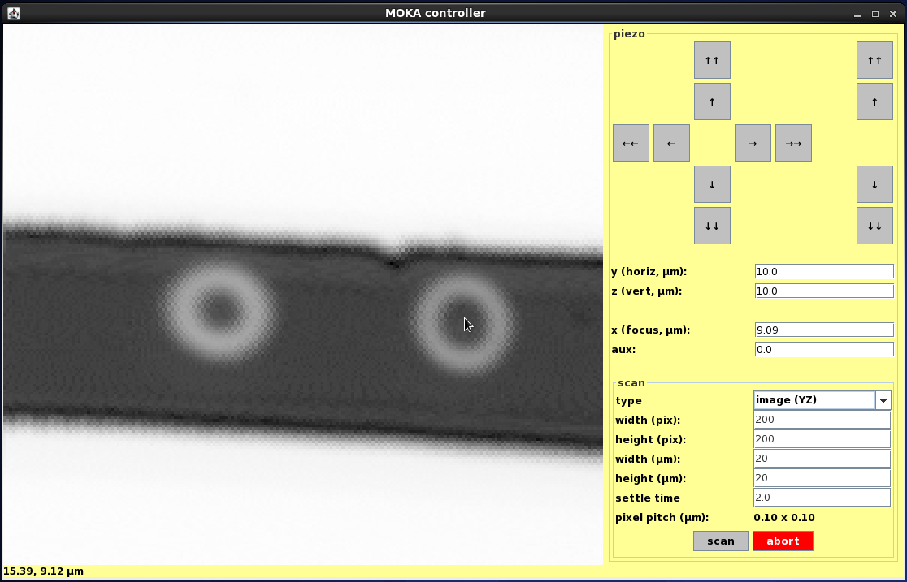

#SetupSoftware

## Controller
Presents an interface to the STM32 based piezo/magnet controller with 8-channel, 16-bit bipolar ADC input.
Expected port: 5000.

## CurrentSense
An interface to a STM32 based current sensor (current through fast photodiode). 
Expected port: 5002.

## FFTGrabber
Records samples from a soundcard and returns the Fourier transform.
Dependencies: 
  * portaudio (Ubuntu 15.04: ``sudo apt-get install portaudio19-dev``)
  * fftw (Ubuntu 15.04: ``sudo apt-get install fftw-dev``)
Expected port: 5004

## HPInterface
Interfaces both with a Prologix or Arduino based GPIB controller hooked up to the HP 8672A signal generator.
Expected port: 5003 for the TX generator (excitation), 5001 for RX (detection).
Arduino-based GPIB controller firmware image: https://github.com/tibal/agipibi.

## HittiteInterface
Presumably talks to Hittite signal generator.

## Moka
java GUI for imaging with the piezo stage.

## FMRScanner
Reads ~/fmr_scanner.ini and performs FMR scan.

## Piezoscanner
Obsolete, replaced by Moka

## PiezoFMR
Obsolete.

## ScannerGUI
Obsolete, replace by Moka

## Libraries
contains certain functions and definitions that are common to all servers and even firmware. It is strongly recommended to use these, and not code your own.
TODO: makefiles

## STM32F-workarea
contains two projects: Controller firmware and CurrentSense firmware

# Protocol definition
Each server will be run by regular user, using a port specified at runtime. Use SSH tunneling for authentication and
security. Public key auth is recommended for automization.

Commands given to a server are always in ASCII, always capital letters. When (multiple) arguments are given, they are seperated by comma's.
For example, the set the position of the piezo stage halfway in each direction, the command will be (given to "Controller"):
SET,POSITION,0.5,0.5,0.5,0.0

To set the HP 8672A to 6.2GHz:
SET,FREQ,6.2e9

Physical values (frequency, current, ...) will always be handled in SI-units. Piezo position and magnet current are limited
between 0 and 1, no unit.

Each server will always reply with two int32_t values. The first holds the exit code, 1/SUCCESS if al went well. The second holds the number of bytes that will 
be returned to the user. If something went wrong, the resulting error code can be looked up in "Libraries/errors.h".
If you do not read all bytes present, they may be present in the input buffer when you read at a later point in time. After
these two bytes come the rest of the data. Returns are binary, not ASCII, unless the ID is requested.

Each server will always reply to the "ID" command with their respective identification string.

*Note: for list of command and parameters, please consult the source of the corresponding server

# Hardware

Design files for the specific electronics used for this projects are summarized in the "Hardware" folder. This may not
always be the latest version.
